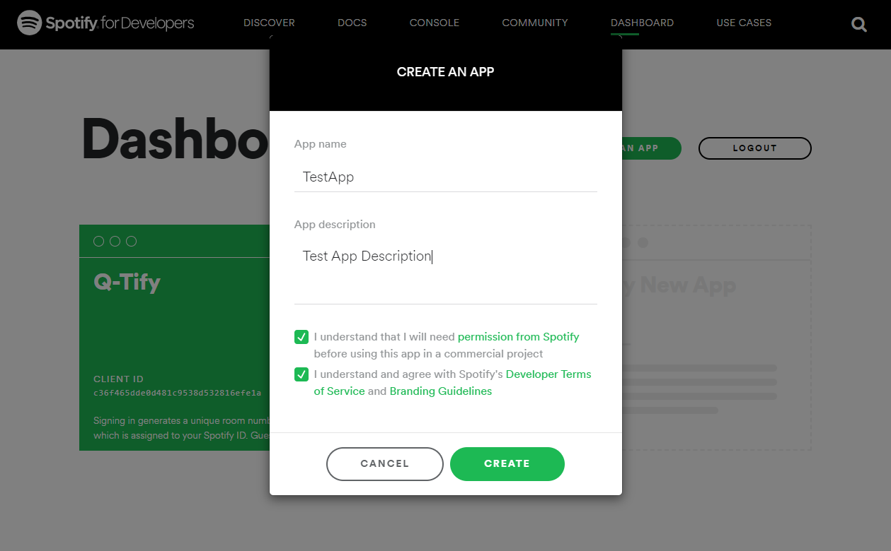
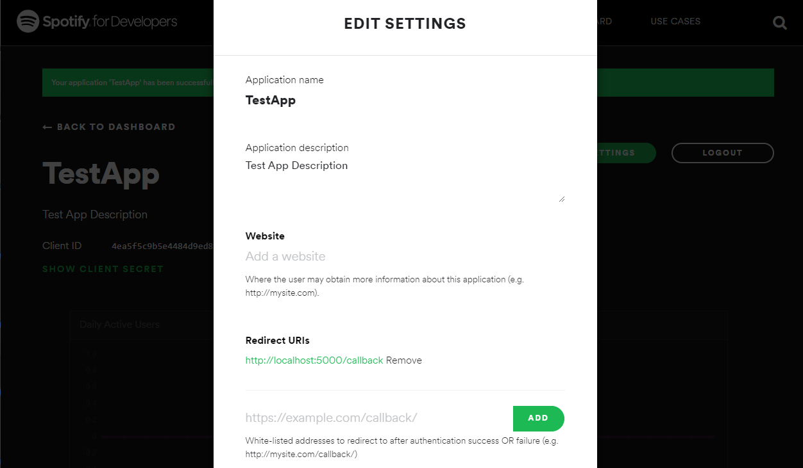
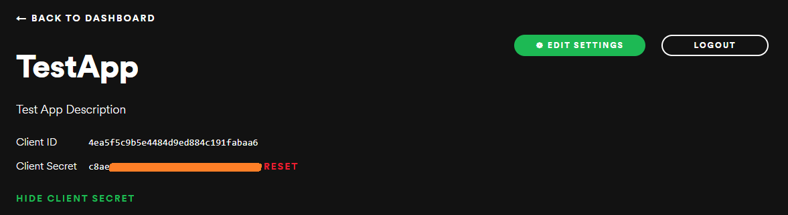

# Q-Tify Pre-reqs
- Python version >= 3.6.0
- Install Python dependencies with the command:
```
pip install -r requirements.txt
```
- Replace placeholder values in `config.py` with your Spotify API credentials
- Replace `localhost:5000` value with your registered Spotify API callback URI or register it as your callback URI
- Optionally set up `uwsgi` using `queue.ini` to create UNIX socket to use with reverse proxy of your choice
- If not using `uwsgi`, simply run `python main.py`
- Load associated URI in web browser to access your instance of the service

## Spotify API Registration
- First, navigate to the [Spotify Developer Dashboard](https://developer.spotify.com/dashboard/) and log in
- Click `Create An App`, enter your app's name and description, and click `Create`

- Once your app has been created, click `Edit Settings` and enter at least one redirect URI for the Spotify Authentication callback (default config value is `http://localhost:5000/callback`). Optionally specify website, Android packages, and/or Apple iOS bundle IDs.
- Click `Save` when finished entering above information

- Finally, click `Show Client Secret` and copy your `Client ID` and `Client Secret` into `config.py`, replacing `YOUR_CLIENT_ID_HERE` and `YOUR_CLIENT_SECRET_HERE` respectively

